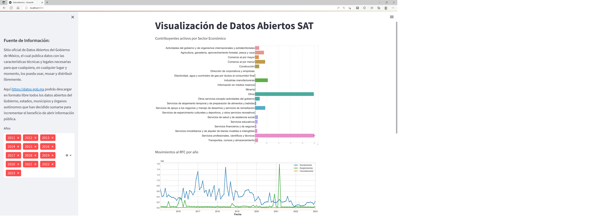

# DataVisualization

### Requirements
- streamlit==1.18.1
- pandas==1.4.4
- matplotlib==3.5.2
- seaborn==0.11.2
- numpy==1.21.5

### Usage
- Clone or download the repository to your local machine
- Install the required packages using pip install -r requirements.txt
- Run with streamlit the DatosAbiertos.py file

### Data
The data used in this project is downloaded from the Official Open Data Site of the Mexican Government.

### Output
Dashboard Datos Abiertos SAT

|||
|-----------------------------|------------------|

