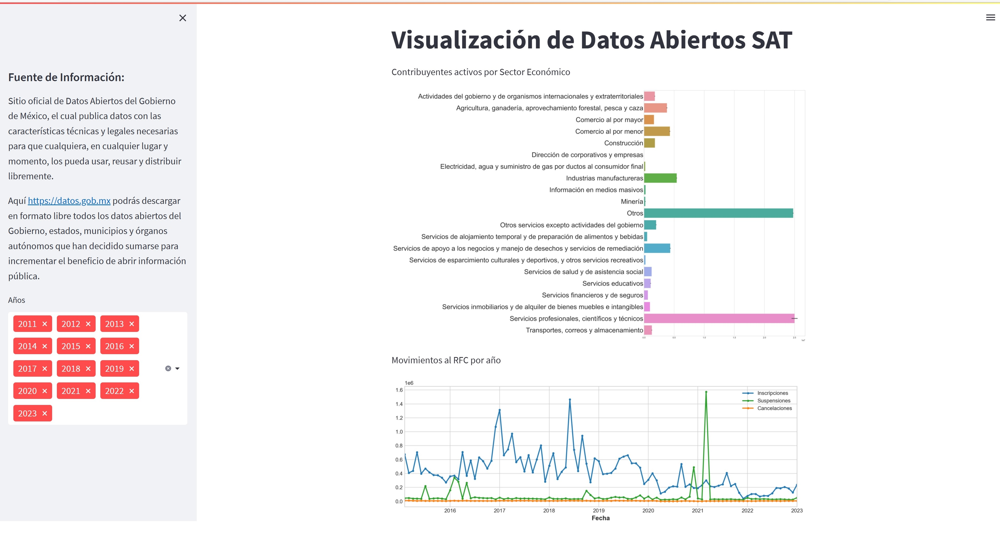

# DataVisualization

### Requirements
streamlit==1.18.1
pandas==1.4.4
matplotlib==3.5.2
seaborn==0.11.2
numpy==1.21.5

### Usage
- Clone or download the repository to your local machine
- Install the required packages using pip install -r requirements.txt
- Run with streamlit the DatosAbiertos.py file

### Data
The museum data used in this project is stored in the museums_Mexico_City.csv file. This file contains for each museum: the name, image URL, website URL, as well as data about if the museum has terrace and I have visit it.

### Output
Dashboard Datos Abiertos SAT

|||
|-----------------------------|------------------|

